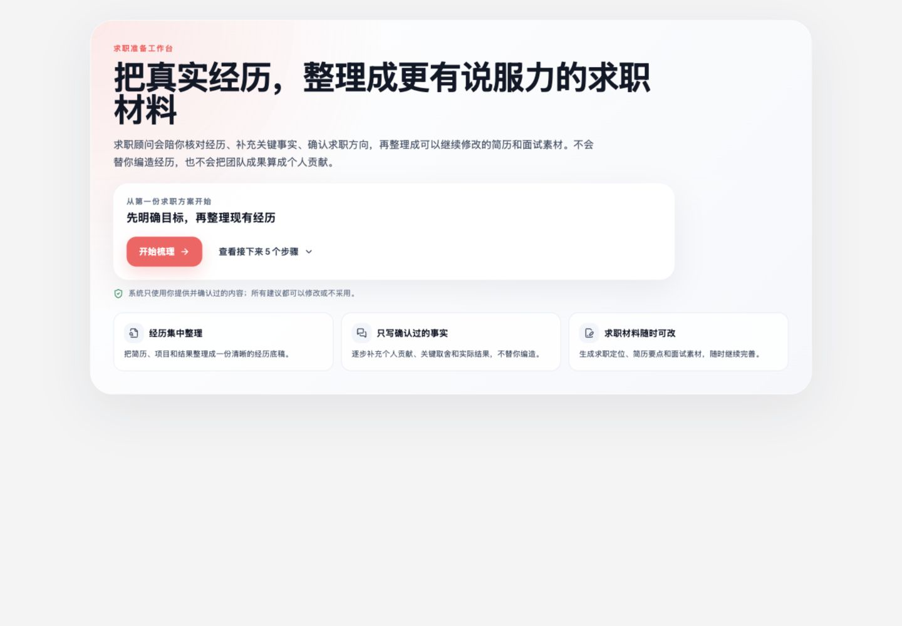
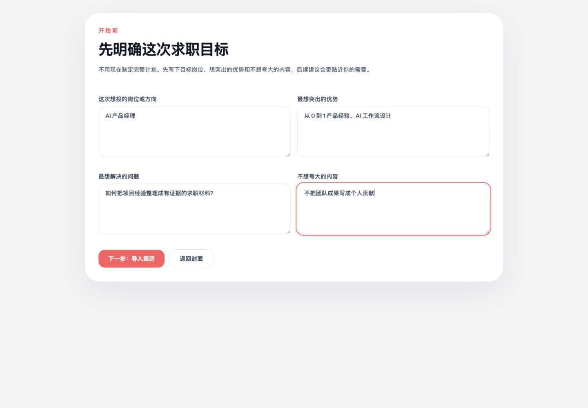
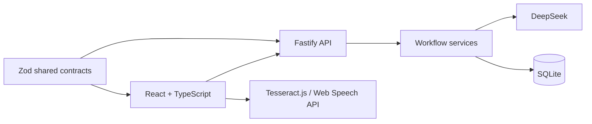

# Know Yourself Before You Find a Job

> 找工作之前，先认识你自己。

一个面向中国求职者的候选人发展 Agent。它不会直接把简历“润色得更厉害”，而是先梳理真实经历、补齐招聘方关心的证据，再基于具体岗位生成可继续修改的求职材料。



## 为什么做这个产品

很多求职者不是没有经历，而是很难快速回忆并说明：自己解决了什么问题、做了哪些关键判断、承担了什么责任，以及结果为什么值得招聘方相信。通用聊天 AI 通常只处理当下的一段文字，也容易顺着用户的表述继续放大。

本项目把候选人理解做成一条可持续的工作流：

- **先建立事实底稿**：从简历中识别工作经历，并由用户逐条核对。
- **再补招聘证据**：通过低压力、回忆式对话补充个人贡献、结果、取舍与影响力。
- **最后做岗位决策**：结合真实 JD 判断是否值得投递，并生成与岗位方向一致的简历版本。

## 适合谁

- 有 2 年以上工作经历，但简历内容零散、难以总结亮点的人。
- 有海外学习或工作背景，希望回国或转向中国市场岗位的人。
- 正在转型产品、增长、AI、运营等知识工作岗位的人。
- 做过很多项目，但容易把团队成果写成个人贡献，或不知道证据边界的人。

它不适合代替用户编造经历，也不是自动投递、职位爬取或招聘 CRM。

## 产品流程



1. **明确求职目标**：记录目标岗位、主打卖点、最大疑问和不希望夸大的边界。
2. **导入简历**：支持 PDF 上传或文本粘贴。
3. **核对经历**：确认公司、岗位、时间和经历主线；识别错误时可重新导入或逐步确认。
4. **选择重点经历**：选择 1–3 段最值得深入梳理的经历。
5. **补充关键事实**：通过对话补充背景、个人贡献、结果和关键判断，并明确不可夸大的内容。
6. **确认求职定位**：生成公司档案与候选人画像，确认本轮简历的主线。
7. **岗位适配决策**：粘贴 JD 或识别岗位截图，输出建议投递、补充后投递、暂不建议投递或信息不足。
8. **生成岗位版简历**：基于已确认事实生成职业总结和分经历要点，支持保存和重新生成。

## AI 在哪里介入

| 环节 | AI 的作用 | 用户控制点 |
| --- | --- | --- |
| 简历解析 | 提取并结构化真实任职经历 | 用户核对公司、岗位、时间和内容 |
| 事实补全 | 总结回答、识别证据缺口、生成下一轮问题 | 用户确认事实总结和表达边界 |
| 候选人画像 | 提炼职业主线、优势、短板和定位边界 | 用户选择最终求职方向 |
| 岗位分析 | 将 JD 要求与已确认事实进行映射 | 用户决定投递、补证据或放弃 |
| 简历改写 | 生成与岗位方向一致的总结和经历要点 | 用户可编辑、保存或重新生成 |

模型不可用时，部分步骤会降级到确定性规则；需要模型判断的流程会返回可恢复错误，不会静默丢失当前草稿。

## 技术架构



- **Web**：Vite、React 18、TypeScript、TanStack Query、Zustand、Tailwind CSS、Lucide Icons
- **API**：Fastify、TypeScript、Zod、Drizzle ORM
- **Persistence**：SQLite，本地单用户、多草稿
- **AI Provider**：DeepSeek，OpenAI-compatible API
- **Document input**：`pdf-parse`、浏览器端图片 OCR
- **Shared contracts**：`packages/shared` 统一维护 DTO、步骤状态和 API schema

## 本地运行

### 环境要求

- Node.js 22 LTS
- pnpm 9
- DeepSeek API key（启用完整 AI 能力时需要）

### 1. 安装依赖

```bash
git clone https://github.com/xiaotiancaixmy/knowyourselfbeforeyoufindajob.git
cd knowyourselfbeforeyoufindajob
corepack enable
corepack prepare pnpm@9.15.0 --activate
pnpm install --frozen-lockfile
```

如果本机没有正确构建原生依赖：

```bash
pnpm rebuild better-sqlite3 esbuild
```

### 2. 配置环境变量

```bash
cp .env.example .env
```

编辑 `.env`：

```env
DEEPSEEK_API_KEY=your_deepseek_api_key_here
DEEPSEEK_BASE_URL=https://api.deepseek.com
DEEPSEEK_MODEL=deepseek-chat
DEEPSEEK_TIMEOUT_MS=30000
API_PORT=3001
API_HOST=127.0.0.1
WEB_ORIGIN=http://localhost:8501,http://127.0.0.1:8501
DATABASE_PATH=app.db
```

### 3. 启动前后端

```bash
pnpm dev
```

- Web：http://localhost:8501
- API health：http://localhost:3001/api/health

### 4. 验证代码

```bash
pnpm check
pnpm test
pnpm build
```

GitHub Actions 会对每次 push 和 pull request 执行同样的检查。

## 项目结构

```text
apps/
  api/              Fastify API、工作流服务、数据库和测试
  web/              React 页面、状态管理、OCR 和组件测试
packages/
  shared/           前后端共享 Zod schema 与 DTO
skills/             项目内 Agent Skills
docs/               产品设计、截图与发布检查
src/ + streamlit_*  早期 Python 原型，仅作为迁移参考
```

## 数据与隐私

- 简历、JD、对话和生成资产默认保存在本机 SQLite，不会提交到 Git。
- 调用 DeepSeek 时，会把当前步骤所需的相关内容发送到配置的模型服务。
- 结构化日志不记录 API key、简历全文、完整 JD 或模型原始输出。
- `.env`、数据库、日志、构建产物和依赖目录都被 `.gitignore` 排除。
- 当前版本没有登录、权限隔离和云端加密，不应直接作为多用户生产服务部署。
- API 与开发服务器默认只监听 `127.0.0.1`；不要把本地端口直接暴露到公网。

## 失败诊断

岗位分析会输出三类结构化事件：

- `job_fit_analysis_succeeded`
- `job_fit_analysis_failed`
- `job_fit_analyses_recovered`

查看最近分析记录：

```bash
sqlite3 app.db \
  "SELECT id, job_target_id, run_state, error_message, diagnostics_json FROM job_fit_analyses ORDER BY id DESC LIMIT 5;"
```

## 当前状态

这是一个可供产品演示、代码评审和本地体验的 MVP，不是生产级招聘平台。已覆盖 onboarding、事实补全、候选人画像、岗位判断和岗位版简历生成；账号体系、云同步、团队协作、运营监控和生产合规仍在范围外。

发布前检查见 [docs/RELEASE_CHECKLIST.md](docs/RELEASE_CHECKLIST.md)。

安全问题请按 [SECURITY.md](SECURITY.md) 中的方式私下报告。本仓库当前用于作品展示和技术评审，代码权利说明见 [LICENSE](LICENSE)。
